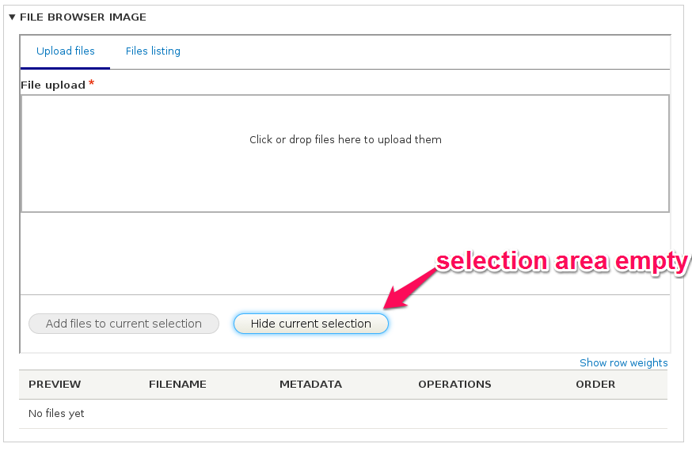
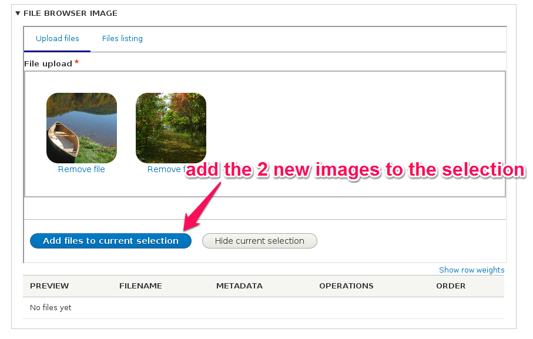
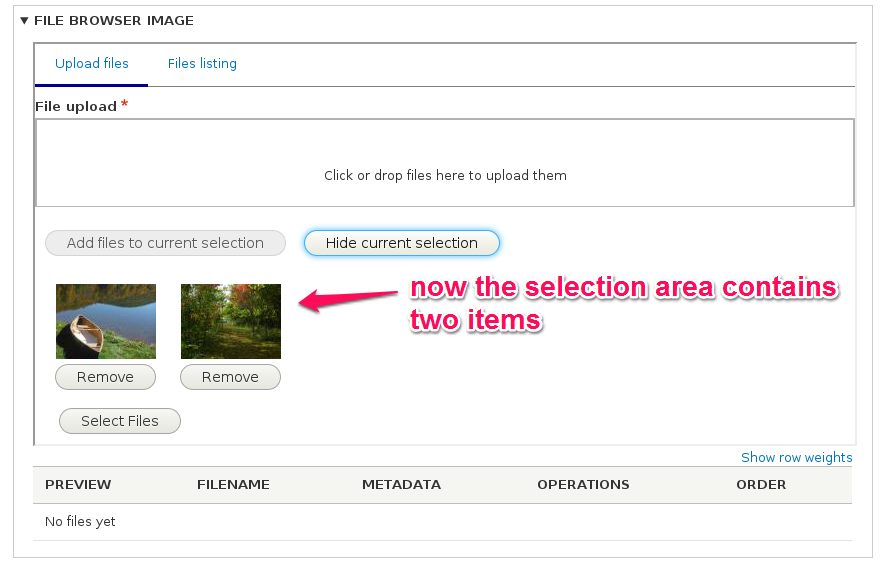
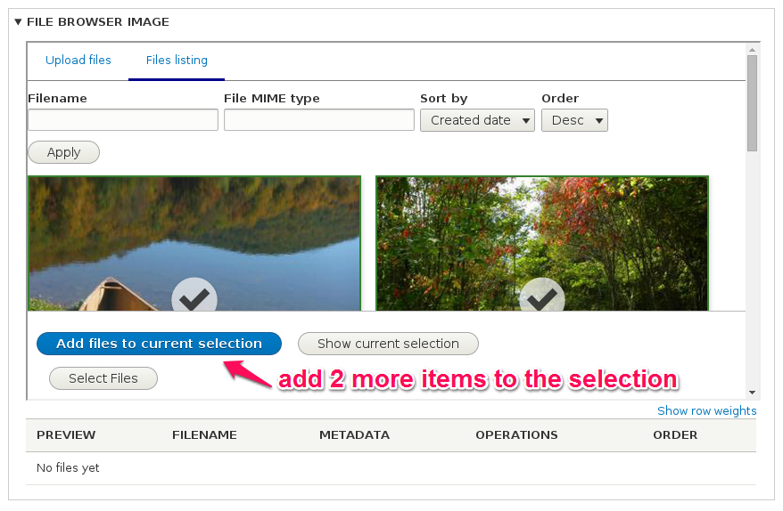
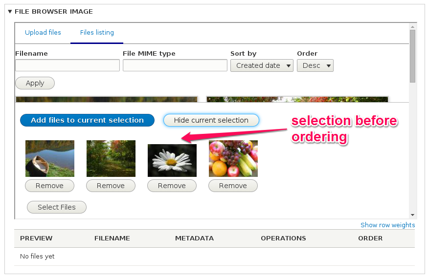
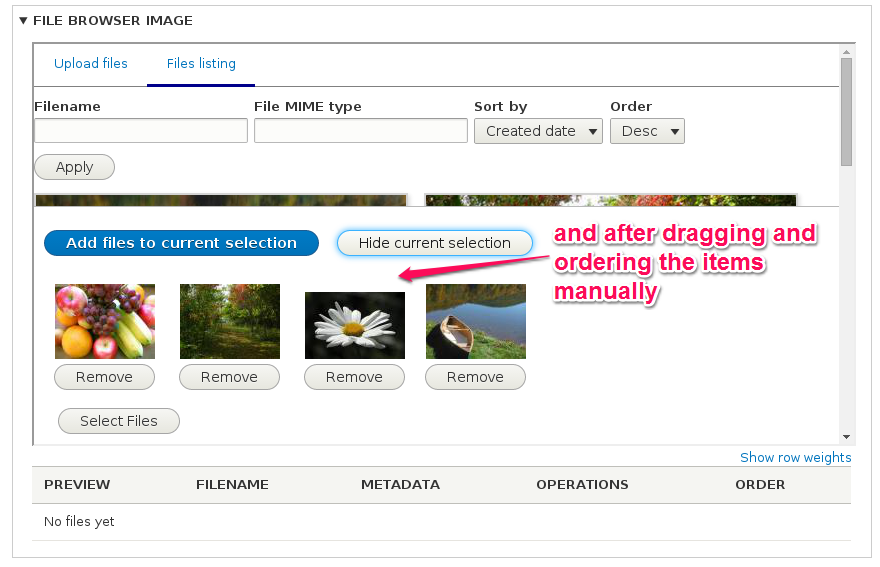
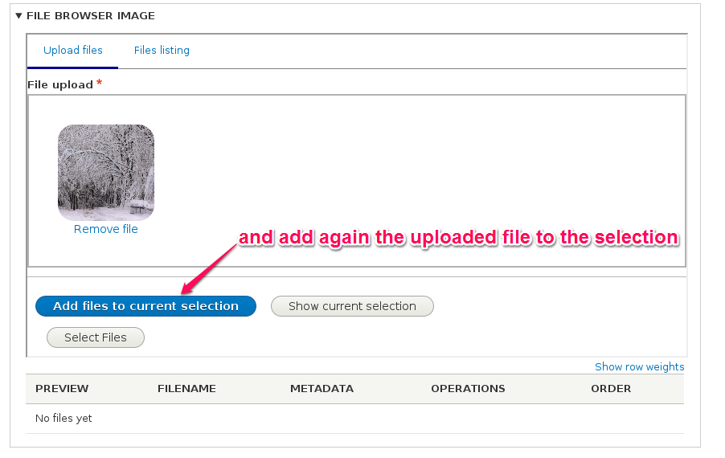
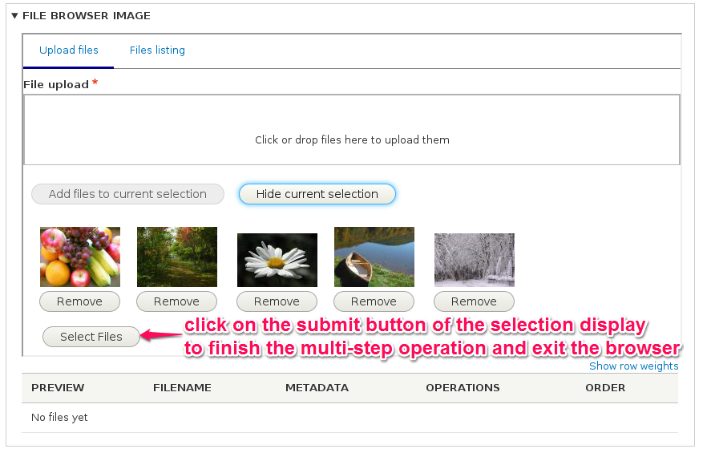
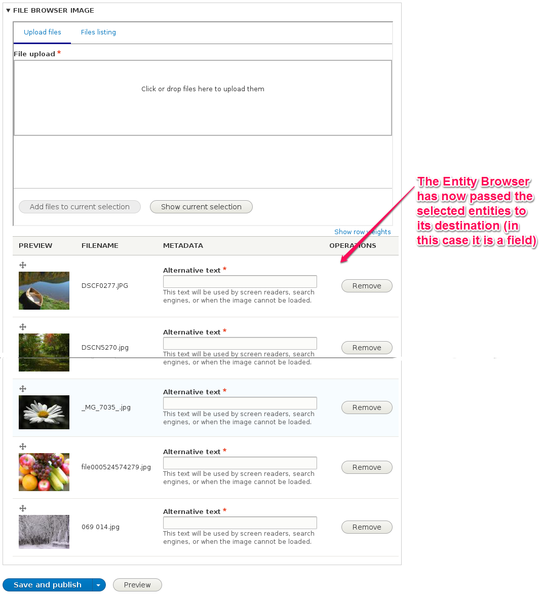

# Selection displays

The **selection display** plugins provide a way for the end user (editor) to deal with the entities that are in process of being selected, but before confirming the operation. You can think of it as a sort of "temporary storage" for the entities that are being "retrieved" by the Entity Browser, while the user is using the browser.

As with the other plugins, contrib and custom modules can extend and provide additional plugins of this type.

The **Entity Browser** module provides the following **selection display** plugins:

### Multi-step selection display

This is the option you might want to use in the most flexible or complex media handling workflows. The **multi-step selection display** allows the editor to use different widgets sequentially in order to populate a **selection set** and these entities being selected will be visible in the **selection** area.

This workflow can be better understood in the following images:

1) Nothing is selected, the **selection set** is empty

2) Upload 2 images using the widget, there is now an option to add these 2 to the current selection

3) Add these 2 images to the selection

4) Let's select now some existing images from the media library

5) We could re-order them to better suit our needs

6) Let's upload a last image

7) We can check the current content of our selection

8) And finally confirm the operation to use the content of our selection display in our field

The **multi-step** selection display provides the following configuration options:
- **Entity type** - The type of the entity being selected. Not all display plugins will need this, and will be ignored if the display being in charge of displaying it on the selection area do not need this information.
- **Entity display plugin** - The plugin responsible for rendering the visualization of the entity inside the selection area.
- **Select button text** - The label to use on the submit button of the selection area

### View selection display

[TODO: make snapshots of this workflow]

The **view** selection display provides the following configuration option:
- **View : view display** - The view name and display name to be used to show the entities in the selection area during the selection.

### No selection display

This option is the simplest alternative, when you do not want your Entity Browser to provide any mechanism to deal with the temporary "selection area" of the entities being retrieved by the browser.

