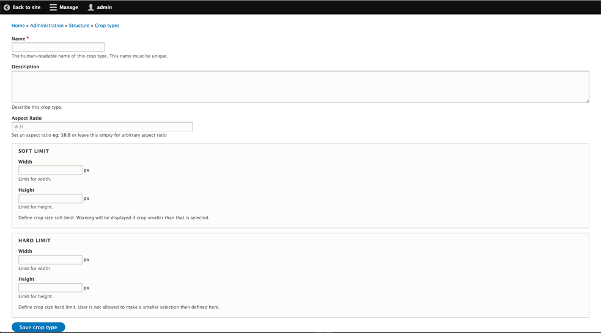
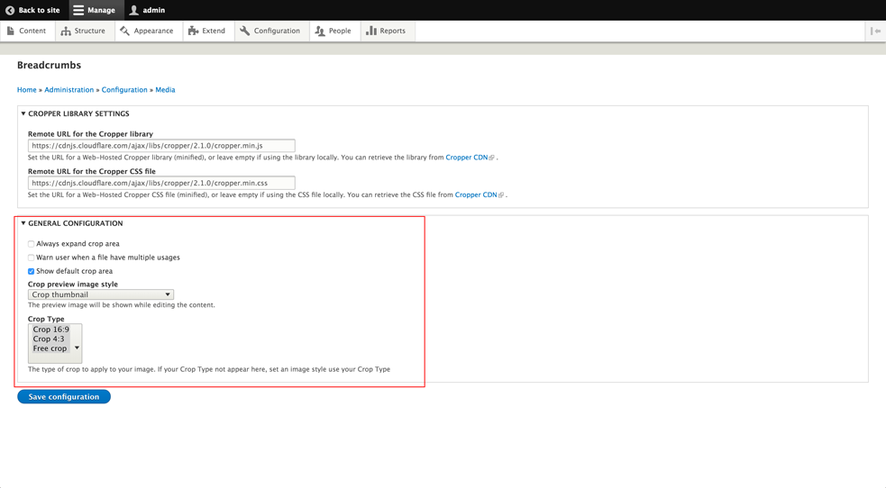

# ImageWidgetCrop module

[ImageWidgetCrop](https://www.drupal.org/project/image_widget_crop) provides an interface for using the features of the [Crop API](https://www.drupal.org/project/crop). This widget provide an UX for use a crop on all fields images. This module have particularity to purpose capability to crop the same image by 'Crop type' configured. It's very usefull for editorial sites or media management sites.

## Try demo module
You can Test ImageWidgetCrop in action directly with the sub-module "ImageWidgetCrop example" to test differents usecase of this module.

You can try the module live with the website dedicated to demonstrate the module [DEMO SITE](http://www.image-widget-crop.com) with demo user 
Psw: "demo"
User: "demo"

You can also see [Demo vidéo](https://www.youtube.com/watch?v=Ioo_bYnCOOg)

## Requirements

1. [Crop API](https://www.drupal.org/project/crop)
1. [Cropper Library](https://github.com/fengyuanchen/cropper)

##Installation

1. Download and extract the module to your (`sites/all/modules/contrib`) folder.
2. Enable the module on the Drupal Modules page (`admin/modules`) or using
   $ drush en

The module is currently using Cropper as a library to display,
 the cropping widget.
To properly configure it, do the following:

* Local library:
  1. Download the latest version of Cropper at
     https://github.com/fengyuanchen/cropper.
  2. Copy the dist folder into:
     - /libraries/cropper or
     - /sites/default/libraries/cropper or
     - /sites/EXAMPLE/libraries/cropper or
     - /sites/all/libraries/cropper
  3. Enable the libraries module.

* External library:
  1. Set the external URL for the minified version of the library and CSS file,
     in Image Crop Widget settings (`/admin/config/media/crop-widget`), found at
     https://cdnjs.com/libraries/cropper.

 NOTE: The external library is set by default when you enable the module.

## Usage

ImageWidgetCrop can be used in different contexts.

### General Configuration
1. Create a Crop Type
  * On `admin/structure` choose **Crop types**
    
  * Click on **+ Add crop type**
    
  * Add Name, Description, Aspect Ratio and Soft/Hard limit for your crop type and click **Save crop type**
    ’”
2. Create an Image Style
  * On `admin/structure/config` choose **Image styles**
    
  * Click on **+ Add image style**
    
  * Add Image style name and click **Create new style**
    
  * Choose Manual crop effect and click **Add**
    
  * Choose your Crop Type, to apply your crop selection, and click **Add effect**
    
3. General configuration
  * ImageWidgetCrop module can be implemented in few usecases. Except with Fields usage the configuration of (`image_crop`) element in (`admin/config/media/crop-widget`).
    

### FormApi
If we need to implement `image_crop` element manually to your forms you can use this general configuration or set all options manualy in code.
  #### Using General configuration:
  ```php
  $crop_config = \Drupal::config('image_widget_crop.settings');
  $form['image_crop'] = [
    '#type' => 'image_crop',
    '#file' => $file,
    '#crop_type_list' => $crop_config->get('settings.crop_list'),
    '#crop_preview_image_style' => $crop_config->get('settings.crop_preview_image_style'),
    '#show_default_crop' => $crop_config->get('settings.show_default_crop'),
    '#warn_mupltiple_usages' => $crop_config->get('settings.warn_mupltiple_usages'),
  ];
  ```
  #### Using Custom element configuration:
  ```php
  $form['image_crop'] = [
    '#type' => 'image_crop',
    '#file' => $file_object,
    '#crop_type_list' => ['crop_16_9', 'crop_free'],
    '#crop_preview_image_style' => 'crop_thumbnail',
    '#show_default_crop' => FALSE,
    '#warn_mupltiple_usages' => FALSE,
  ];
  ```

## Maintainers

- [Alexandre Mallet (@woprrr)](https://drupal.org/user/858604)
- [Janez Urevc (@slashrsm)](https://drupal.org/user/744628)
