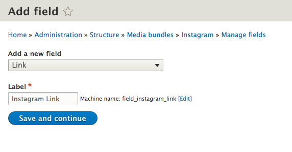
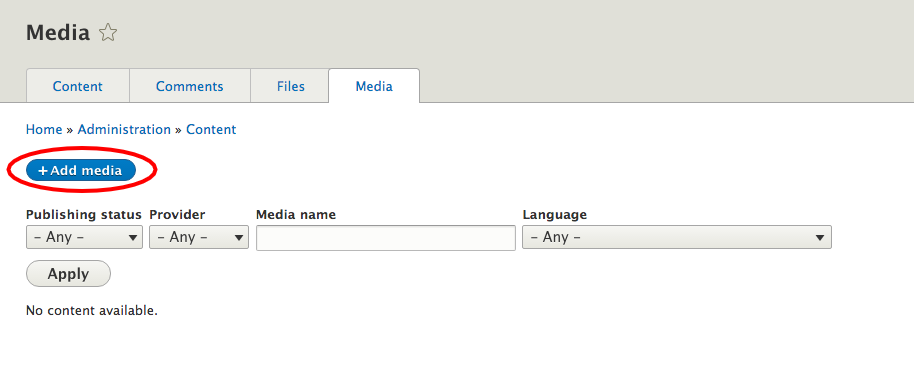
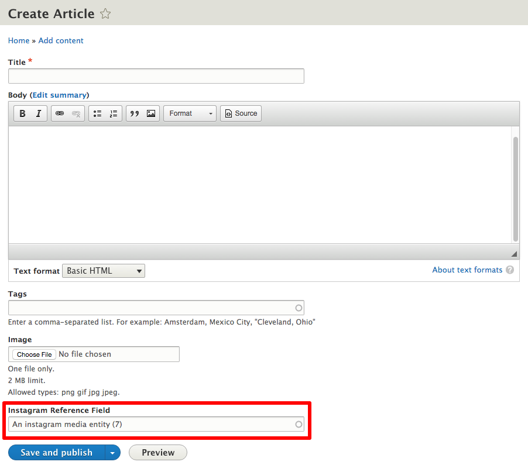

# Instagram

Implements media entity resource provider for Instagram photos and videos.

Project page: (https://drupal.org/project/media_entity_instagram)

## Requirements

1. [Media Entity](https://www.drupal.org/project/media_entity)

## Installation

1. Download [Media Entity](https://www.drupal.org/project/media_entity) from Drupal.org.
2. Download [Media Entity Instagram](https://drupal.org/project/media_entity_instagram) from Drupal.org.
3. Install both Media Entity Instagram and Media Entity in the [usual way](https://www.drupal.org/documentation/install/modules-themes/modules-8).

## Overview

Instagram field formatter can be used with three different types of fields:
* Text plain fields `string_long`, `string_short`
* Link fields
* Entity reference that references appropriate media bundles

In the **Usage** section configuration of media bundles and supported field types will be described in detail.

## Usage

1. Create a Media bundle
  * On `admin/structure` choose **Media bundles**
    
  * Click on **+ Add media bundle**
    
  * Fill *Label*, *Description* and *Type provider fields* for your media bundle and click **Save media bundle**
    
2. Create an Instagram link field on a Media bundle
 * On media bundles overview page choose **Manage fields** on created **Instagram** bundle.
   
 * Click on **+ Add field**. For a storage type choose **Link**, fill a *Label* field and click **Save and continue**.
   

2. Create a Media entity
  * On `admin/content/media` click on **+ Add media**
    
  * Fill *Media name*, *Instagram link* fields similarly as it is displayed below and click **Save**.
    
  * The created Instagram media entity is saved.
  
    
3. Add an entity (media) reference field on a content type
  * On desired content type (i.e. Article), on `admin/structure/types`, click on **Manage fields**
    
  * Click on **+ Add field**
    
  * From **References** menu choose **Other**, fill the *Label* and click **Save and continue**
    
  * Choose **Media** for **Type of item to reference** and click **Save field settings**
      
  * Select **Instagram** bundle in **Reference type section** and click **Save settings**
          
4. Add a Text plain (long) field on a content type
  * Repeat the first two steps from the section below. Select **Text (plain, long)** from **Add a new field** menu, fill the *Label* and click **Save and continue**
  
5. Add a Link field on a content type
  * Go to **Add a new field** page by following the steps from **Step 3**. Select **Link** from **Add a new field** menu, fill the *Label* and click **Save and continue**
    
5. Open Manage display of your content type (in our case *Article*), on `admin/structure/types/manage/article/display`
  * Select **Instagram embed** for the three freshly created fields (*Text plain*, *Link*, *Entity media reference*) and then **Save**
  
6. Create a new article with embedded Instagram posts
  * For an **Instagram reference** field choose a created entity Instagram entity. **Text** and **Link** fields fill with URLs to Instagram posts.
    
  * The Instagram posts are displayed on the saved article page.
